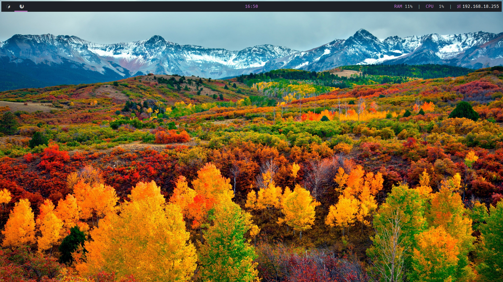
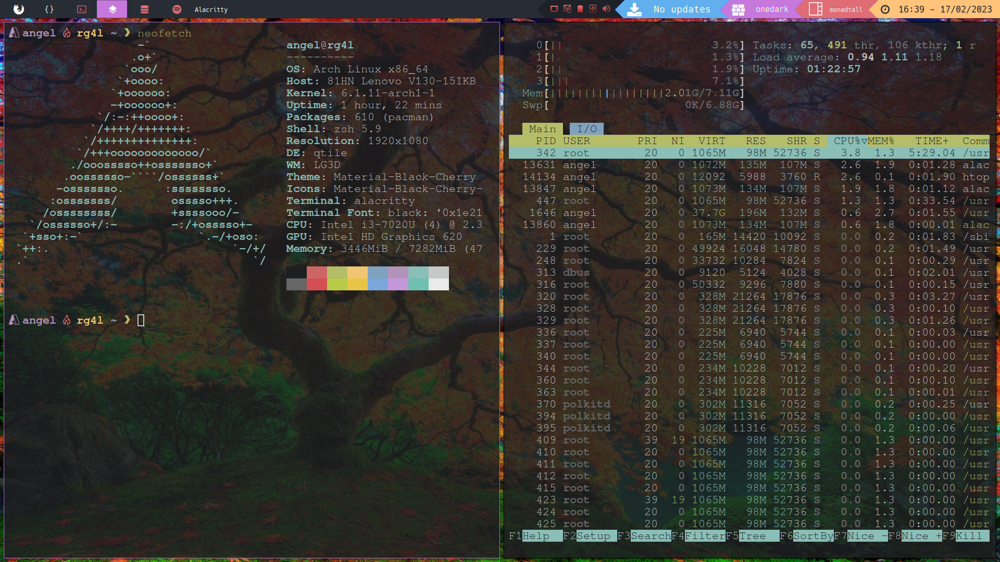
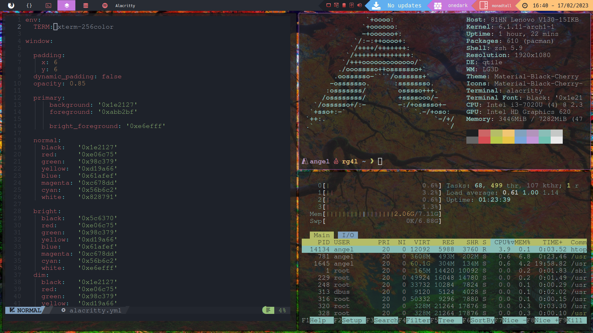
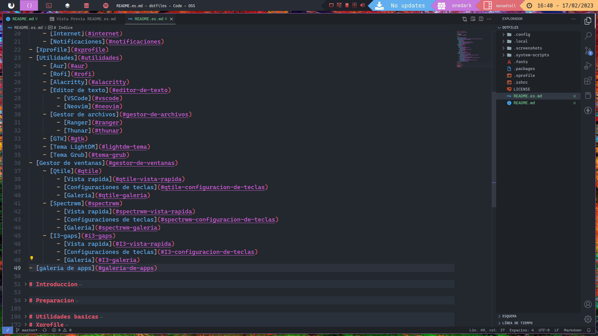
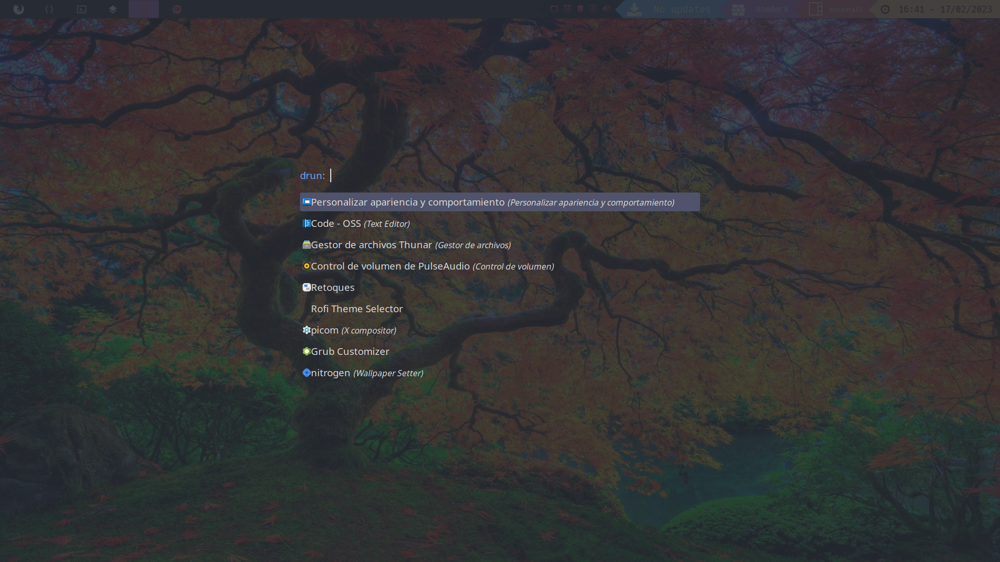
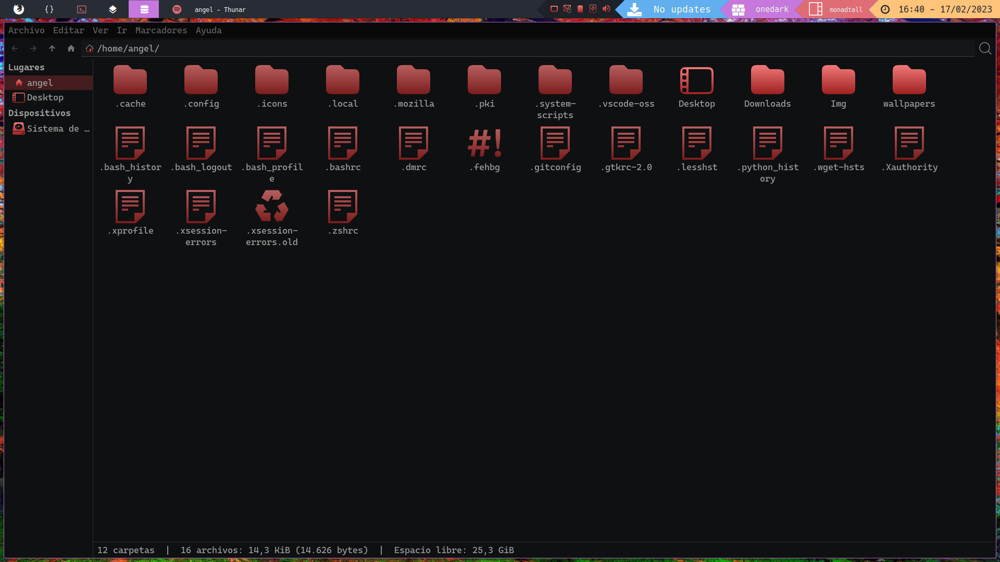

# Dotfiles & Configuranciones


***Language***
- 🇪🇸 Español
- [🇺🇸 English](./README.md)

# Indice

- [Introduccion](#introduccion)
- [Preparacion](#preparacion)
- [Inicio de sesion & Gestores de ventanas](#inicio-de-sesion-gestores-de-ventamas)
- [Utilidades basicas](#Utilidades-basicas)
    - [Audio](#audio)
    - [Brillo](#brillo)
    - [Fuentes](#fuentes)
    - [Fondos de pantalla](#fondos-de-pantalla)
    - [Dispositivos externos](#dispositivos-externos)
    - [Internet](#internet) 
    - [Notificaciones](#notificaciones)
- [Xprofile](#xprofile)
- [Utilidades](#utilidades)
    - [Aur](#aur)
    - [Rofi](#rofi)
    - [Alacritty](#alacritty)
    - [Editor de texto](#editor-de-texto)
        - [VSCode](#vscode)
        - [Neovim](#neovim)
    - [Gestor de archivos](#gestor-de-archivos)
        - [Ranger](#ranger)
        - [Thunar](#thunar)
    - [GTK](#gtk)
    - [Tema LightDM](#lightdm-tema)
    - [Tema Grub](#tema-grub)
- [Gestor de ventanas](#gestor-de-ventanas)
    - [Qtile](#qtile)
        - [Vista rapida](#qtile-vista-rapida)
        - [Configuraciones de teclas](#qtile-configuracion-de-teclas)
        - [Galeria](#qtile-galeria)
    - [Spectrwm](#spectrwm)
        - [Vista rapida](#spectrwm-vista-rapida)
        - [Configuraciones de teclas](#spectrwm-configuracion-de-teclas)
        - [Galeria](#spectrwm-galeria)
    - [I3-gaps](#i3-gaps)
        - [Vista rapida](#I3-vista-rapida)
        - [Configuraciones de teclas](#I3-configuracion-de-teclas)
        - [Galeria](#I3-galeria)
- [galeria de apps](#galeria-de-apps)

# Introduccion
Este es el manual the como instalar y cofigurar mi ento rno de escritorio como lo tengo actualmente. Para esta guia debes estar comodo con la CLI de Linux y tener cierta experiencia en este nicho. Tambien debes de tener en cuenta que en esta guia nos centramos en los gestores de ventana de tipo 'Tiling'.

# Preparacion
En esta guia el punto de partida que vamos a tener es la [instalacion base de Arch Linux](https://wiki.archlinux.org/title/Installation_guide). Si has avanzado un poco y ya tienes estas dependencias instaladas, activadas y construidas: [NetworkManager](https://wiki.archlinux.org/title/NetworkManager), [GRUB](https://wiki.archlinux.org/title/GRUB), [sudo](https://wiki.archlinux.org/title/Sudo), [xorg](https://wiki.archlinux.org/title/xorg); puedes saltarte este paso. Estos paquetes son esenciales para el correcto funcionamiento del sistema.

El primer paso es instalar y activar [NetworkManager](https://wiki.archlinux.org/title/NetworkManager).
```bash
pacman -S networkmanager
systemctl enable --now NetworkManager 
```
El segundo paso es montar el manejador de arranque, yo en este caso usare [grub](https://wiki.archlinux.org/title/GRUB). En mi caso la particion efi la tengo montada en **/boot/efi** pero si en tu caso la tienes montada en **/boot** no hay problema.

```bash

# Solo Archlinux
pacman -S grub efibootmgr 
grub-install --target=x86_64-efi --efi-directory=/boot # Si tu particion efi esta en /boot/efi pon en el campo --efi-boot /boot/efi
grub-mkconfig -o /boot/grub/grub.cfg

# Archlinux con Windows
pacman -S nfts-3g os-prober
grub-install --target=x86_64-efi --efi-directory=/boot # Si tu particion efi esta en /boot/efi pon en el campo --efi-boot /boot/efi
# Debes editar el archivo /etc/default/grub y descomentar or cambiar a false GRUB_DISABLE_OS_PROBER
os-prober
grub-mkconfig -o /boot/grub/grub.cfg
``` 

Ahora crea tu usuario y añadelo a el grupo wheel
```bash
useradd -m usuario
passwd usuario
usermod -aG wheel usuario
```

En este momento ya estas listo para instalar [sudo](https://wiki.archlinux.org/title/Sudo)
```bash
pacman -S sudo
# Descomenta esta linea de el archivo /etc/sudoers -> # %wheel ALL=(ALL) ALL
```

Ahora puedes desmontar la ISO y reiniciar
```bash
exit
umount -R /mnt 
reboot
```

Cuando se encienda el ordenador puedes comprobar que todo este en orden y conectate a tu red con [nmcli](https://man.archlinux.org/man/nmcli.1.en).

Finalmente instala [Xorg](https://wiki.archlinux.org/title/xorg), este paquete nos da la posibilidad de utilizar gestores de ventanas.
```bash
sudo pacman -S xorg-server 
```

# Utilidades basicas
Esto es software que necesitas a menos que quieres que tu sistema sea practicamente inutil

## Audio
Para usar el audio en tu equipo necesita instalar estas 4 dependencias: [pulseaudio](https://wiki.archlinux.org/title/PulseAudio) es el nucleo del controlador de audio, [pavucontrol](https://archlinux.org/packages/extra/x86_64/pavucontrol/) es la GUI para controlar el audio, [pamixer](https://archlinux.org/packages/community/x86_64/pamixer/) es un CLI para controlar el audio, [volumeicon](https://archlinux.org/packages/community/x86_64/volumeicon/) es para controlar el audio desde el systray.

```bash
sudo pacman -S pulseaudio pavucontrol volumeicon pamixer
```

## Brillo
El brillo puede ser controlado desde [brightnessctl](https://archlinux.org/packages/community/x86_64/brightnessctl/) asi que vamos a instalarlo.

```bash
sudo pacman -S brightnessctl
```

## Fuente
Todas las fuentes que utilizo son de [nerd fonts](https://www.nerdfonts.com/), excepto [cascadia code](https://github.com/microsoft/cascadia-code). Todas mis fuentes estan en el archivo .fonts.
Pequeña guia para instalar fuentes
```bash
unzip font.zip
sudo mkdir /usr/share/fonts/TTF 
sudo mv font/*.ttf /usr/share/fonts/TTF
```

## Fondos de pantalla
Para los fondos de pantallas hay dos herramientas principales y son [feh](https://wiki.archlinux.org/title/Feh) y [nitrogen](https://wiki.archlinux.org/title/Nitrogen).

```bash
sudo pacman -S feh nitrogen
```
Pero en mi caso a mi no me gusta usar siempre el mismo fondo de pantalla asi que hice una pequeña utilidad que esta en  .system-scripts/wallpaper.sh que pone una aleatoriamente una imagen .jpg de fondo de pantalla, para usarlo tienes que editar unas líneas.
```bash
#!/usr/bin/bash
num_wallpaper=$(($RANDOM%{Numero de fondos de pantallas que tienes}}))
feh --bg-scale /path/to/wallpapers/folder/$num_wallpaper.jpg
```

## External devices
Para utilizar conexiones USBs solo tienes que instalar [udiskie](https://archlinux.org/packages/community/any/udiskie/) and [nfts-3g](https://wiki.archlinux.org/title/NTFS-3G)

```bash
sudo pacman -S udiskie nfts-3g
```

## Network-applet
[nm-applet](https://wiki.archlinux.org/title/NetworkManager#nm-applet) es un paquete que nos ayuda a controlar internet desde el systray.
```bash
sudo pacman -S network-manager-applet
```

## Notifications
Podemos tener notificaciones con los paquetes: [libnotify](https://archlinux.org/packages/extra/x86_64/libnotify/) and [notification-daemon](https://archlinux.org/packages/community/x86_64/notification-daemon/).

```bash
sudo pacman -S libnotify notification-daemon
```
```bash
# Crea este archivo con nano
sudo nano /usr/share/dbus-1/services/org.freedesktop.Notifications.service
# Escribe esto
[D-BUS Service]
Name=org.freedesktop.Notifications
Exec=/usr/lib/notification-daemon-1.0/notification-daemon
```
# Xprofile

Xprofile es un archivo que nos permite iniciar comandos nada mas iniciar sesion en tu dispositivo, esto es muy importante para configurar cosas como el fondo de pantalla o el audio . Xprofile por defecto viene con el paquete xorg-server pero si tienes algun problema instala [xinit](https://wiki.archlinux.org/title/Xinit).

Crea el archivo **/home/user/.xprofile**
```bash
touch ~/xprofile
```
Editalo y añade lineas
```bash
# Audio
pulseaudio --kill &
pulseaudio --start &
# Network
nm-applet &
# Automount Devices
udiskie -t &
# systray volume
volumeicon &
# Wallpaper
random-wallpaper # Si no tienes este script escribe feh --bg-scale /path/to/your/wallpaper
```

Cuando vuelvas a iniciar sesion si todo a salido bien veras los cambios reflejados
# Utilidades

En esta seccion vamos a hablar de utilidades que no son necesarias pero las recomiendo
## AUR
[Aur](https://aur.archlinux.org/) es un software que complementa con mas paquetes de los que vienen con pacman [Pacman](https://wiki.archlinux.org/title/pacman), cuando instalas aur tiene acceso a mucho mas paquetes como [google-chrome](https://aur.archlinux.org/packages/google-chrome).

AUR puede ser manejado com muchos [manejadores AUR](https://wiki.archlinux.org/title/AUR_helpers) en mi caso yo uso [paru](https://aur.archlinux.org/packages/paru).

Primero hay que instalar [git](https://wiki.archlinux.org/title/git)
```bash
sudo pacman -S git
```
Posteriormente crear un directorio para manejar los paquetes instaladops con git
```bash
mkdir -p Downloads/repos # Puedes poner cualquier nombre
```
En este momento podemos decargar el repositorio y construirlo
```bash
git clone https://aur.archlinux.org/paru-bin.git # Haz estos comandos en el directorio que hemos creado
cd paru-bin/
makepkg -si
```
Para asegurarnos de que esta todo bien vamos a hacer este comando 
```bash
paru --version
```
Si hay output paru esta correctamente instalado.
## Rofi
[Rofi](https://wiki.archlinux.org/title/rofi) es un menu que nos da la posibilidad de abrir programas facilmente. Ademas es muy personalizable.
```bash
sudo pacman -S rofi
```
Yo personalmente recomiendo añadir rofi vuestros atajos de teclado.
Mis configuraciones estan *.config/rofi/rofi.rasi* y el tema One Dark para rofi es de https://github.com/davatorium/rofi-themes/blob/master/User%20Themes/onedark.rasi

## Picom
[Picom](https://wiki.archlinux.org/title/picom) es un programa que nos dota de la posibilidad de dar transparencia y sobra a nuestras ventanas, tambien nos va a venir bien para configurar alacritty.
```bash
sudo pacman -S picom
```
Agrega picom a *.xprofile*.
```bash
picom &
```
## Alacritty 
[Alacritty](https://wiki.archlinux.org/title/Alacritty) es el emulador de terminal mas rapido del mundo porque esta escrito en rust.
```bash
sudo pacman -S alacritty
```
Mi configuracion de alacritty *.config/alacritty/alacritty.yml*

## Editor de texto
Este paso no es para nada necesario pero si eres programador los editores de textos son basicos.

### VSCode
[VSCode](https://wiki.archlinux.org/title/Visual_Studio_Code) es el editor de texto mas popular. En mi caso es el editor de texto que mas utilizo. Mis configuraciones estan en *.config/Code-OSS/settings.json*.
```bash
sudo pacman -S code
```
### Neovim
[Neovim](https://wiki.archlinux.org/title/Neovim) es el otro editor de texto que utilizo, es mas complejo que VSCode pero si le echas tiempo y te acostrumbras es una buena opcion. Las configuraciones no son mias, son de [NvChad](https://nvchad.com/).
```bash
sudo pacman -S neovim
```

## Gestor de archivos

### Ranger
[Ranger](https://wiki.archlinux.org/title/Ranger) es un gestor de archivos de terminal, por ello es mas complicado que la opcion que voy a dar ahora, pero es mas ligero. Mis configuraciones estan en *.config/ranger*.
```bash
sudo pacman -S ranger
```
### Thunar
[Thunar](https://wiki.archlinux.org/title/Thunar) es un gestor de archivos grafico.
```bash
sudo pacman -S thunar
```
## GTK
GTK es una herramienta basica para configurar tu sistema. Con Gtk podemos configurar iconos, temas, etc...

Mi tema es [Material Dark Cherry](https://www.gnome-look.org/p/1316887/)
```bash
unzip Tema.zip
sudo mv Tema /usr/share/themes
```
Y mis iconos [Material Dark Cherry Suru](https://www.pling.com/p/1333360/)
```bash
unzip Iconos.zip
sudo mv Iconos /usr/share/icons
```

Con esto has instalado los iconos y el tema pero no estan configurados para que aparezcan, [lxappearence](https://archlinux.org/packages/community/x86_64/lxappearance/) es una herramienta que nos ayuda para configurar temas y iconos.
```bash
sudo pacman -S lxapppearence
``` 
## LightDM tema
LightDM puede ser configurado para tener una mejor experiencia de usuario. Yo tengo el [aether theme](https://aur.archlinux.org/packages/lightdm-webkit-theme-aether)
```bash
sudo pacman -S lightdm-webkit2-greeter
paru -S lightdm-webkit-theme-aether
```

En esta linea greeter-session escribe lightdm-webkit2-greeter en */etc/lightdm/lightdm.conf*
Y en esta linea webkit_theme ecribe lightdm-webkit-theme-aether en */etc/lightdm/lightdm-webkit2-greeter.conf*

## Tema Grub 
Grub puede ser configurado con [grub customizer](https://archlinux.org/packages/community/x86_64/grub-customizer/).

```bash
sudo pacman -S grub-customizer
```

Mi tema de grub es https://github.com/vinceliuice/grub2-themes.
# Window Managers
## Qtile
### Qtile Vista Rapida
Qtile es una opcion perfecta para empezar en el mundo de los gestores de ventanas de tipo tiling, esta escrito en python y tiene un archivo de configuracion muy sencillo, toda mi configuracion esta en *.config/qtile*. En mi caso yo tendo un widget personalizado, si quieres copiar mi configarion tambien deberias copiar el widget.  
```bash
sudo pacman -S qtile
# Si quieres copiar mi configuracion
sudo pacman -S pacman-contrib
pip install psutil
```
### Qtile configuracion de teclas
|Teclas       |Programa
--------------|-----------
|MOD+Return   |Alacritty
|MOD+f        |Firefox
|MOD+m        |Rofi
|MOD+Control+w|Random wallpaper (custom command)
|MOD+s        |Scrot

### Qtile Galeria


## Spectrwm

### Spectrwm Vista Rapida
Spectrwm es tambien una buena opcion para empexar, esta escrito en c, para configurarlo solo tienes que editar .config/spectwm/spectrwm.conf y para la barra superior tienes que hacer un script en bash que de salida. Mis configraciones estan en *.config/spectrwm*
```bash
sudo pacman -S spectrwm
```
### Spectrwm configuraciones de teclas
|Teclas       |Programa
--------------|-----------
|MOD+Return   |Alacritty
|MOD+f        |Firefox
|MOD+m        |Rofi
|MOD+Shift+w  |Random wallpaper (custom command)
|MOD+s        |Scrot

### Spectrwm Galeria


## I3

### I3 Overview
I3 en mi opnion es mas dificil de configurar, por eso no lo recomiendo para empezar, esta escrito en c, para configurarlo necesitas editar el archivo .config/i3/config y yo uso [polybar](https://github.com/polybar/polybar) para la barra superior. Mis configuraciones estan en *.config/i3* y *.config/polybar*.
```bash
sudo pacman -S i3-wm  polybar
```
### I3 configuraciones de teclas
|Teclas       |Programa
--------------|-----------
|MOD+Return   |Alacritty
|MOD+f        |Firefox
|MOD+m        |Rofi


### I3 galeria

# Galeria de apps

## Alacritty

## Nvim & Alacritty

## VSCode

## Rofi

## Thunar
